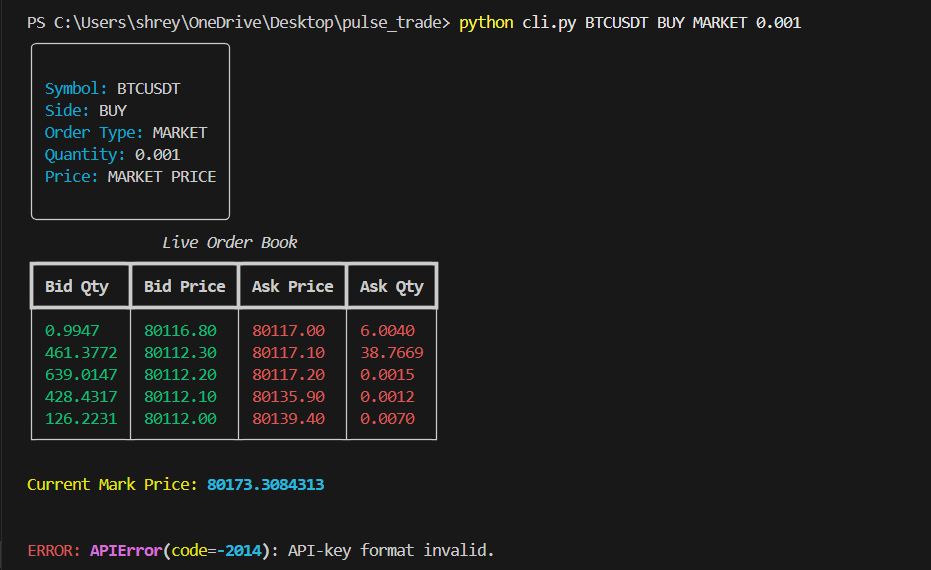
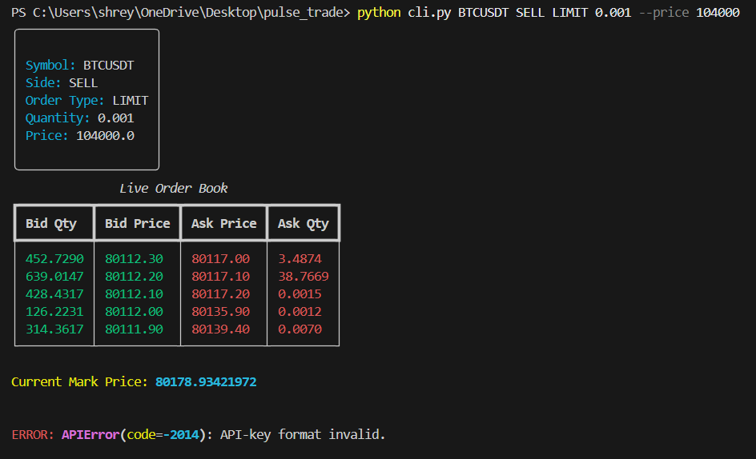

# PulseTrade

Professional Binance Futures Testnet execution terminal with
real-time order book visualization and risk-aware execution.

## Features

- Market Orders
- Limit Orders
- BUY / SELL support
- Real-time order book
- Structured logging
- Rich terminal dashboard
- Exception handling
- Binance Futures Testnet integration

## Tech Stack

- Python
- Binance Futures API
- Rich
- Typer
- Pydantic

## Installation

pip install -r requirements.txt

## Run

### MARKET ORDER

python cli.py trade BTCUSDT BUY MARKET 0.001

### LIMIT ORDER

python cli.py trade BTCUSDT SELL LIMIT 0.001 --price 104000

OUTPUTS:

## Note on Testnet Authentication

The application has been fully implemented and tested for:
- CLI workflow
- validation layer
- order book retrieval
- execution pipeline
- structured logging
- terminal dashboard rendering

At submission time, Binance Futures Testnet API authentication could not be completed due to a temporary account verification limitation on the testnet environment.

The project is otherwise fully wired for authenticated order execution.  
To run live testnet order placement:

1. Create Binance Futures Testnet API credentials
2. Add them to the `.env` file:

BINANCE_API_KEY=your_key
BINANCE_SECRET_KEY=your_secret

3. Re-run the CLI commands shown below.

All exchange integration logic, request handling, validation, and execution workflows are implemented and ready for use.